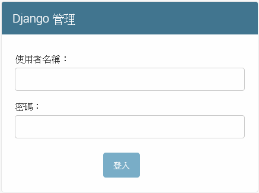
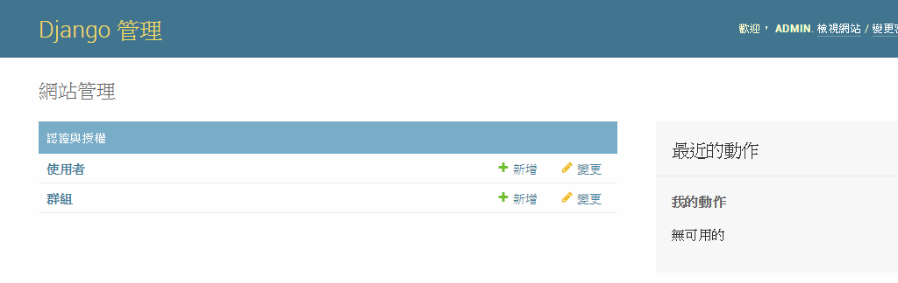
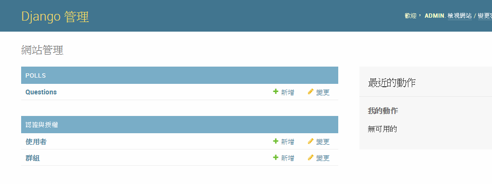

PART2
=====

## 設置資料庫
> 本學習項目使用預設的SQLite

在**study_project/settings.py**中的module-level 變數代表Django的設置。默認情況下，資料庫配置使用SQLite。SQLite包含在Python中，因此無需安裝任何其他東西來支持資料庫。

如果您希望使用其他資料庫，請安裝相應的[資料庫綁定](https://docs.djangoproject.com/en/2.1/topics/install/#database-installation)，並更改`DATABASES.default`中的以下屬性以匹配您的資料庫連接設置：
- **ENGINE**：
  - `'django.db.backends.sqlite3'`
  - `'django.db.backends.postgresql'`
  - `'django.db.backends.mysql'`
  - `'django.db.backends.oracle'`
- **NAME**：資料庫名稱。如果使用的是SQLite，則資料庫是電腦上的文件(如db.sqlite3)，**NAME**應該是包括文件名的完整絕對路徑。
  - 默認值`os.padb.sqlite3th.join(BASE_DIR，'db.sqlite3')`表示將文件存儲在Project根目錄中(**study_project/db.sqlite3**，manage.py旁邊)。

如果不使用SQLite作為數據庫，則必須添加其他設置，如`USER`，`PASSWORD`和`HOST`。(官方說明：[DATABASES](https://docs.djangoproject.com/en/2.1/ref/settings/#std:setting-DATABASES))

完成數據庫的配置，請將`TIME_ZONE`設置為您的時區。
```py
TIME_ZONE = 'Asia/Taipei'
```

文件頂部的`INSTALLED_APPS`設置，包含了這個Django實體中被啟用的所有Django應用程序名稱。默認情況下，INSTALLED_APPS包含以下應用程序：
- `django.contrib.admin` - 管理站點。你很快就會用到它。
- `django.contrib.auth` - 身份驗證系統。
- `django.contrib.contenttypes` - 內容類型的框架。
- `django.contrib.sessions` - 會話框架。
- `django.contrib.messages` - 一個消息傳遞框架。
- `django.contrib.staticfiles` - 用於管理靜態文件的框架。

其中一些應用程序至少使用了一個資料庫的資料表，因此需要在使用它們之前在資料庫中創建資料表。請運行以下命令：
```py
python manage.py migrate
```
- `migrate`命令使資料庫狀態與當前的模型(Model)和遷移(Migration)集合同步。
- `migrate`命令查看`INSTALLED_APPS`設置，並根據資料庫設置以及應用程序附帶的資料庫遷移(Migration)創建任何必要的資料庫的資料表。

> 要查看SQLite的資料庫的資料表，可以使用[DB Browser for SQLite](https://sqlitebrowser.org/)。

## 創建模型(Model)
Model在本質上是資料庫的佈局(layout)，它包含了您要存儲資料的欄位和行為。 Django遵循DRY原則(Don’t repeat yourself)，目標是在一個地方定義您的資料模型，並自動從中獲取數據。

這包括了遷移(Migration)。遷移完全源自模型文件，實質上只是Django通過更新數據庫架構來匹配當前模型的歷史記錄。

在投票應用程序中，將創建兩個Model：**Question** 和 **Choice**。每個選擇都與一個問題相關聯。
- **Question**：包含一段描述問題的文字和發佈日期。
- **Choice**：包含選項的的文字和投票記錄。

這些概念由Python的類別(Class)來表示。在**polls/models.py**中，定義了上述的類別：
```py
from django.db import models

# Create your models here.
class Question(models.Model):
  question_text = models.CharField(max_length=200)
  pub_date = models.DateTimeField('date published')

class Choice(models.Model):
  question = models.ForeignKey(Question, on_delete=models.CASCADE)
  choice_text = models.CharField(max_length=200)
  votes = models.IntegerField(default=0)
```
- 每個模型類別繼承了`django.db.models.Model`類別。每個模型類別的變數代表了模型中的資料庫資料表的欄位。
- 每個欄位由**Field**類別的實例表示
  - 字符欄位的`CharField`，需要指定`max_length`
  - 日期時間的`DateTimeField`
  - 整數欄位的`IntegerField`，使用可選參數`default`將默認值設置為0
- 每個**Field**實例的變數名稱(例如`question_text`或`pub_date`)是資料表欄位名稱
- 使用`ForeignKey`定義在資料庫中資料之間的關係(每個**Choice**都與一個**Question**有關)

## 啟用模型(Model)
Model為Django提供了大量資訊。有了它，Django能夠：
- 為應用程序創建數據庫架構(SQL的CREATE TABLE語句)
- 創建用於存取**Question**和**Choice**物件的Python資料庫存取API

首先必需要讓Project安裝投票應用程序。要在Project中包含應用程序，需要在Project配置文件的**INSTALLED_APPS**列表中添加應用程序配置類別的引用。

**PollsConfig**類別位於**polls/apps.py**文件中，其引用路徑為'polls.apps.PollsConfig'。

在**study_project/settings.py**中，並將引用路徑添加到**INSTALLED_APPS**列表：
```py
INSTALLED_APPS = [
    'django.contrib.admin',
    'django.contrib.auth',
    'django.contrib.contenttypes',
    'django.contrib.sessions',
    'django.contrib.messages',
    'django.contrib.staticfiles',
    'polls.apps.PollsConfig',
]
```

安裝完投票應用程序後，運行以下命令：
```
python manage.py makemigrations polls
```
成功執行命令後，將獲得以下訊息：
```
Migrations for 'polls':
  polls\migrations\0001_initial.py
    - Create model Choice
    - Create model Question
    - Add field question to choice
```
- `makemigrations`命令將根據檢測到的Model的變更來創建新的遷移。
- 由於在投票應用程序中創建了兩個新模型(Choice和Question)，`makemigrations`將此變更存儲為遷移(Migration)。
- 遷移(Migration)是存儲Django對Model(以及數據庫架構)變更的文件(polls/migrations/0001_initial.py)。

透過`sqlmigrate`命令將可以從遷移文件取得實際運行的SQL語句：
```
python manage.py sqlmigrate polls 0001
```

**polls/migrations/0001_initial.py**的SQL語句如下：
```sql
BEGIN;
--
-- Create model Choice
--
CREATE TABLE "polls_choice" ("id" integer NOT NULL PRIMARY KEY AUTOINCREMENT, "choice_text" varchar(200) NOT NULL, "votes" integer NOT NULL);
--
-- Create model Question
--
CREATE TABLE "polls_question" ("id" integer NOT NULL PRIMARY KEY AUTOINCREMENT, "question_text" varchar(200) NOT NULL, "pub_date" datetime NOT NULL);
--
-- Add field question to choice
--
ALTER TABLE "polls_choice" RENAME TO "polls_choice__old";
CREATE TABLE "polls_choice" ("id" integer NOT NULL PRIMARY KEY AUTOINCREMENT, "choice_text" varchar(200) NOT NULL, "votes" integer NOT NULL, "question_id" integer NOT NULL REFERENCES "polls_question" ("id") DEFERRABLE INITIALLY DEFERRED);
INSERT INTO "polls_choice" ("id", "choice_text", "votes", "question_id") SELECT "id", "choice_text", "votes", NULL FROM "polls_choice__old";
DROP TABLE "polls_choice__old";
CREATE INDEX "polls_choice_question_id_c5b4b260" ON "polls_choice" ("question_id");
COMMIT;
```
- 輸出的SQL語句將根據使用的數據庫而有所不同，本學習項目使用預設的SQLite。
- `sqlmigrate`命令實際上並不在資料庫上運行遷移的SQL語句，其用途在於檢查Django將要執行的SQL操作。

要執行遷移中的SQL語句(在數據庫中創建資料表)，必須再次運行`migrate`命令：
```
python manage.py migrate

Operations to perform:
  Apply all migrations: admin, auth, contenttypes, polls, sessions
Running migrations:
  Applying polls.0001_initial... OK
```
-`migrate`命令接受所有尚未應用的遷移並針對資料庫運行它們
- Django使用資料庫中名為**django_migrations**的特殊資料表來追蹤哪些遷移已被應用
- 實質上，`migrate`命令是讓Model的變更與資料庫架構進行同步。

遷移功能非常強大，可以在開發項目時隨時更改模型，而無需刪除數據庫或表並創建新數據庫(專門用於實時升級數據庫，而不會丟失數據)。

進行模型更改的三步指南：
- 更改Model(在models.py中)。
- 運行`python manage.py makemigrations`創建這些更改的Migration
- 運行`python manage.py migrate`將這些更改應用於資料庫。

##  操作 database API
使用交互式Python shell來操作[database API](https://docs.djangoproject.com/en/2.1/topics/db/queries/)。透過Django調用Python shell，須執行以下命令：
```
python manage.py shell
```
- **manage.py**將設置`DJANGO_SETTINGS_MODULE`環境變量，為Django提供**study_project/settings.py**文件的Python導入路徑。

為了讓Python物件中表示資料庫表數據，Django使用直觀的系統：Model類別表示資料庫表，該類別的實例表示資料庫表中的特定記錄。

### 創建物件
要創建物件，請使用Model類別的關鍵字參數對其進行實例化，然後調用save()方法將其保存到資料庫中。

```py
>>> from polls.models import Choice, Question  # 匯入 Model類別 (Choice & Question)

# 創建一個新的問題物件
# Djang設置文件中o默認啟用了對時區的支持，pub_date的日期時間必需包含時區的資訊。
# 使用timezone.now()來獲得正確的日期時間格式。
>>> from django.utils import timezone
>>> q = Question(question_text="你喜歡吃?", pub_date=timezone.now())

>>> q.save() # 將物件保存到資料庫中。
```
- 實際上是在資料庫執行SQL語句`INSERT`。在明確調用`save()`之前，Django不會存取資料庫。

保存後通過Python屬性存取模型欄位值：
```py
>>> q.id # 現在物件有一個ID
1
>>> q.question_text
'你喜歡吃?'
>>> q.pub_date
datetime.datetime(2018, 12, 24, 11, 33, 4, 15940, tzinfo=<UTC>)
```
### 修改物件
通過屬性的變更來更改資料值，然後調用`save()`。
```py
>>> q.question_text = "你喜歡喝?"
>>> q.save()
```
- 實際上是在資料庫執行SQL語句`UPDATE`。在明確調用`save()`之前，Django不會存取資料庫。

### 檢索物件
從資料表中檢索物件的最簡單方法是獲取所有的物件。在`Question.objects`上調用all()方法：
```py
>>> Question.objects.all()
<QuerySet [<Question: Question object (1)>]>
```

`<QuerySet [<Question: Question object (1)>]>`不是該物件的有用的表示。通過編輯模型類別(在**polls/models.py**文件中)，在Question和Choice中添加`__str__()`方法來解決這個問題：
```py
from django.db import models

# Create your models here.
class Question(models.Model):
  question_text = models.CharField(max_length=200)
  pub_date = models.DateTimeField('date published')
  # 更改Question物件的表示
  def __str__(self):
    return self.question_text

class Choice(models.Model):
  question = models.ForeignKey(Question, on_delete=models.CASCADE)
  choice_text = models.CharField(max_length=200)
  votes = models.IntegerField(default=0)
  # 更改Choice物件的表示
  def __str__(self):
    return self.choice_text
```

添加`__str__()`方法添加後的輸出：
```py
>>> from polls.models import Choice, Question
>>> Question.objects.all()
<QuerySet [<Question: 你喜歡喝?>]>
```
- 將`__str__()`方法添加到模型中非常重要，不僅是為了在處理互動式視窗時的方便性，還因為物件的表示被使用在Django自動生成的管理員頁面中。

以下是使用過濾器檢索特定物件的範例：
```py
>>> Question.objects.filter(id=1)
<QuerySet [<Question: 你喜歡喝?>]>
>>> Question.objects.filter(question_text__startswith='你')
<QuerySet [<Question: 你喜歡喝?>]>
>>>
```
以下是使用`get()`方法檢索單個物件：
```py
# 獲取今年發布的問題
>>> from django.utils import timezone
>>> current_year = timezone.now().year
>>> Question.objects.get(pub_date__year=current_year)
<Question: 你喜歡喝?>

# 通過主鍵精確查找的快捷方式。
>>> Question.objects.get(pk=1)
<Question: 你喜歡喝?>
```

### 自定義方法
在**Question**模型類別添加判斷是否是最近發佈的方法：
```py
from django.db import models

import datetime
from django.utils import timezone

# Create your models here.
class Question(models.Model):
  # ...
  # 判斷是否是最近發佈
  def was_published_recently(self):
    return self.pub_date >= timezone.now() - datetime.timedelta(days=1)
```

透過Python Shell來確認自定義方法是否運作正確：
```py
>>> q = Question.objects.get(pk=1)
>>> q.was_published_recently()
False
```
- 如果時間差超過一天為`False`

### 相關物件
在模型中定義關係時(即**ForeignKey**，**OneToOneField**或**ManyToManyField**)，該模型的實例將具有存取相關物件的API。

如果模型具有**ForeignKey**(如**Choice**)，則 foreign-key模型的實例(如**Question**)將可以存取一個**RelatedManager**。

默認情況下，此**RelatedManager**名為FOO_set(如**choice_set**)，其中FOO是來源模型名稱的小寫。此**RelatedManager**返回**QuerySets**，可以對其進行過濾和操作。

```py
>>> q = Question.objects.get(pk=1)
>>> q.choice_set.all() # 顯示相關物件集中的任何Choice物件
<QuerySet []>

# 透過相關物件集創建新的Choice物件在特定的Question物件中
>>> q.choice_set.create(choice_text='珍珠奶茶', votes=0)
<Choice: 珍珠奶茶>
>>> q.choice_set.create(choice_text='蜂蜜檸檬', votes=0)
<Choice: 蜂蜜檸檬>
>>> q.choice_set.create(choice_text='拿鐵', votes=0)
<Choice: 拿鐵>

# 創建出來的Choice物件具有對其相關Question物件的API存取權限。
>>> c = q.choice_set.create(choice_text='柳橙汁', votes=0)
>>> c.question
<Question: 你喜歡喝?>

# 反之亦然：Question物件可以存取Choice物件。
>>> q.choice_set.all()
<QuerySet [<Choice: 珍珠奶茶>, <Choice: 蜂蜜檸檬>, <Choice: 拿鐵>, <Choice: 柳橙汁>]>
>>> q.choice_set.count()
4

# 使用delete()方法刪除其中一個Choice物件。
>>> c = q.choice_set.filter(choice_text__startswith='拿')
>>> c.delete()
(1, {'polls.Choice': 1})
>>> q.choice_set.all()
<QuerySet [<Choice: 珍珠奶茶>, <Choice: 蜂蜜檸檬>, <Choice: 柳橙汁>]>
```

## Django管理員頁面
Django為了解決站點管理員創建統一界面來編輯內容的問題，Django能完全地自動化為Model創建管理界面。

### 創建管理員用戶
首先，我們需要創建一個可以登錄管理站點的用戶。運行以下命令：
```
python manage.py createsuperuser

使用者名稱 (leave blank to use 'user-name'): admin
電子信箱: admin@example.com
Password:
Password (again):
Superuser created successfully.
```
- 密碼至少使用 8 個字元，要有大小寫字母及數字

### 使用管理員頁面
Django管理頁面默認是啟用。讓我們啟動開發服務器並進行探索。 如果服務器沒有運行，請啟動它：
```
python manage.py runserver
```
- 現在，打開瀏覽器並轉到本地網域上的“/admin/”(例如http://127.0.0.1:8000/admin/)。您應該看到管理員的登錄畫面。
- 由於默認情況下啟用翻譯，因此登錄畫面可能會以您自己的語言顯示，具體取決於您的瀏覽器設置以及Django是否有此語言的翻譯。



登錄進入管理站點後，將看到以下管理首頁:


- 您應該看到幾種類型的可編輯內容：使用者和群組。它們由Django的身份驗證框架**django.contrib.auth**提供。

## 在管理員頁面修改Model
我們需要告訴管理員**Question**物件要有一個管理界面。為此，請打開**polls/admin.py**文件，並將其編輯為如下所示：
```py
from django.contrib import admin

# Register your models here.
from .models import Question

admin.site.register(Question)
```
- 編輯及完成後儲存，重新整理管理員頁面。

現在我們已經註冊了Question，Django知道它應該顯示在管理首頁上：


單擊“Question”將進入變更列表頁面以查詢Question。此頁面顯示數據庫中的所有Question，您可以選擇一個更改它。
- 表單是從Question模型自動生成的。
- 不同的模型欄位類型（DateTimeField，CharField）對應於相應的HTML輸入小部件。每種類型的欄位都知道如何在Django管理員中顯示自己。